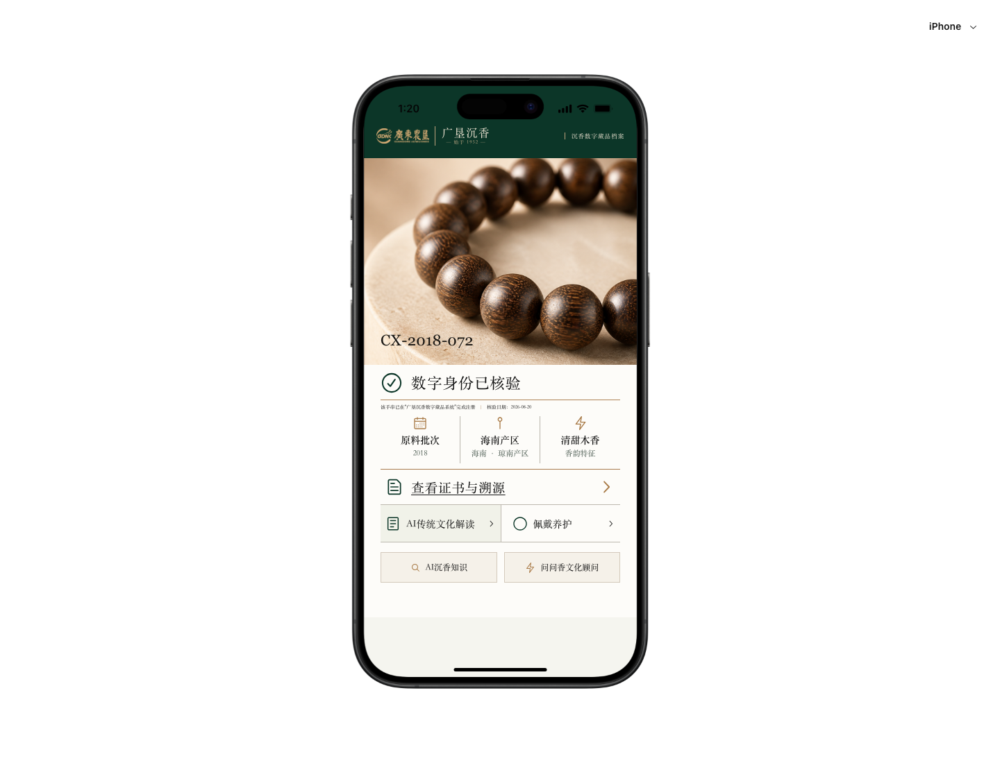
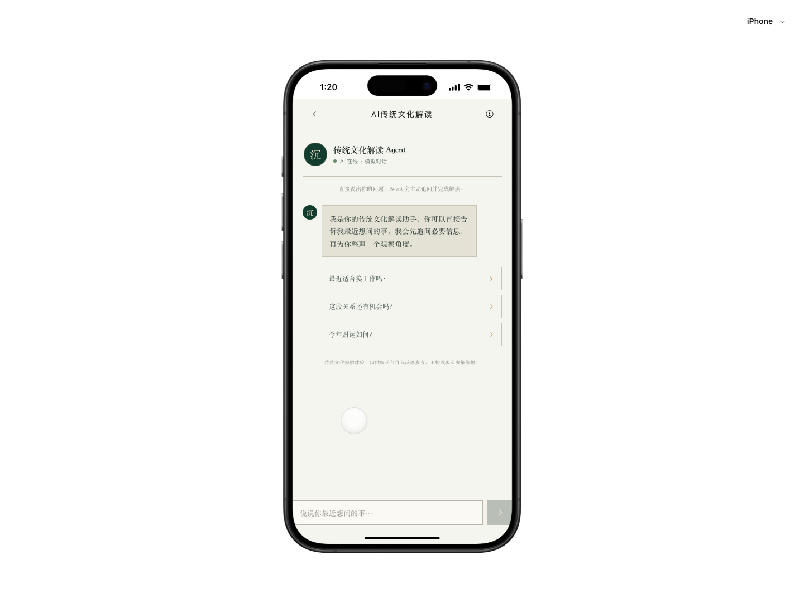
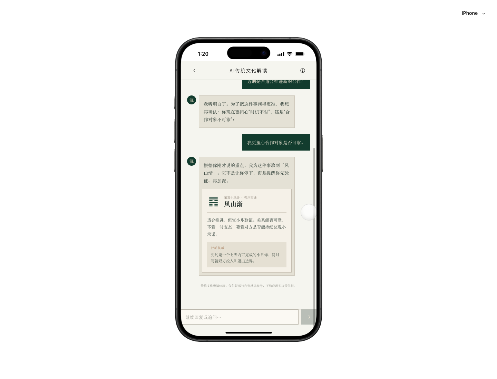

# AI 手串需求原型 UI 走查

- 日期：2026-08-21
- 范围：NFC 首页入口 → 传统文化解读 Agent 首屏 → 两轮追问与卦象结果
- 模式：UX + 视觉 + 截图可见的无障碍风险
- 结论：功能路径成立，但 Agent 内页存在明显的通用 AI 聊天模板感，需要重做视觉命题与信息构图，不建议继续做表面润色。

## Step 1：首页入口 — 基本健康

优点：产品照片、深绿品牌栏、档案编号和核验信息构成了明确的“可信藏品档案”叙事；主次结构明显，品牌专属性较强。

问题：AI 入口与“佩戴养护”同权，作为需求原型的关键体验不够突出；核验说明和底部辅助入口字号过小；截图中持续出现半透明白色圆形光标，像未清理的原型残留。

## Step 2：Agent 首屏 — 需重做

优点：用户无需填表即可直接提问；输入框位于拇指区，基本交互路径清楚。

问题：圆形头像、在线状态、灰色气泡、三条推荐问题、底部输入框组成了标准 AI 助手模板；页面只继承首页的米色和深绿，没有继承手串照片、档案语法、沉香材质或品牌识别。顶部标题、Agent 身份和说明重复表达同一件事。大面积空白没有叙事目的，推荐问题又被三个相同边框矩形平均分配，缺少第一视觉焦点。

## Step 3：追问与解读 — 可用但缺乏可信设计

优点：AI 先追问再解读，产品逻辑正确；用户消息与 AI 消息能被区分，卦象内容也包含行动建议。

问题：结果采用“气泡内再套结果卡，再套行动提示”的三层容器，模板感很强；六十四卦符号像直接粘贴的字符，没有形成专属视觉资产；自动滚动后顶部用户消息被固定栏裁切；结果没有利用 NFC 手串的编号、年份、产区或香韵，用户感受不到为什么必须从这条手串进入。

## 最高优先级问题

### P0：重构 Agent 的视觉命题

不要继续把它做成“东方配色的 ChatGPT”。建议采用“沉香问帖 / 私人解签档案”的编辑式对话：对话仍然存在，但减少左右气泡，把 AI 内容做成纵向问帖、批注和卦帖；唯一视觉记忆点应是与当前手串绑定的“本串问帖”。

### P0：建立首页与 Agent 的连续性

进入 Agent 时保留一条轻量的手串身份带：缩略图、CX-2018-072、2018 / 琼南 / 清甜木香。它既解释 NFC 入口，也让解读页具有项目专属性。

### P1：减少模板组件

删除“在线状态”、重复说明和三条同款推荐卡；首屏只保留一句开场、一个自然语言输入和 2–3 个轻量示例短语。结果页取消卡片套卡片，用版面分区、细线、字号和留白建立层级。

### P1：重新建立字体与信息尺度

当前辅助文字普遍过小、对比偏低。正文建议不低于 15px，重要提示至少 12px；宋体只用于标题、卦名和短句，长对话改用可读性更稳定的界面字体。

### P1：修复完成度问题

移除或隐藏大号半透明圆形光标；修复自动滚动后消息被顶栏裁切；确保推荐项触控区域至少 44×44px。

## 视觉评分

- 首页：78 / 100，结构与品牌方向基本成立。
- Agent：49 / 100，明显命中 AI 模板特征，按评分规则需要重做而不是表面美化。
- 整体：60 / 100，核心体验的视觉质量拉低了完整原型。

## 证据限制

本次结论基于 iPhone 尺寸的真实流程截图和可见交互状态。截图可以识别字号、对比、层级、裁切与触控尺寸风险，但不能证明完整的 WCAG 合规、读屏顺序、键盘导航、低端机性能或所有异常状态。
