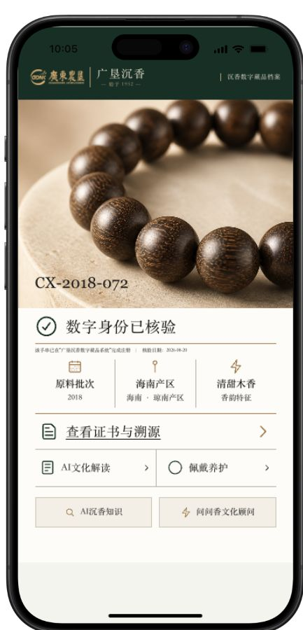
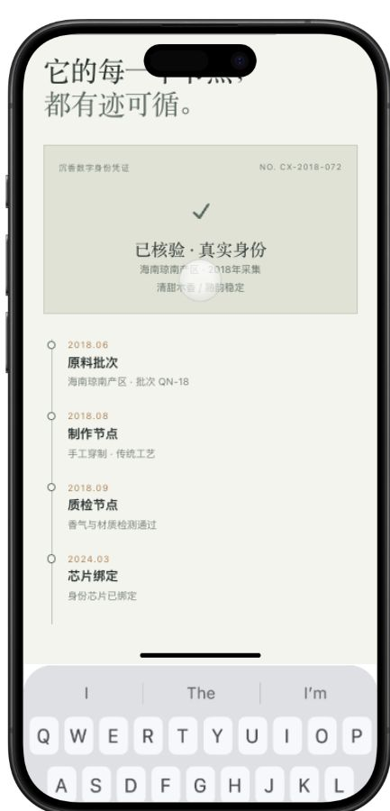
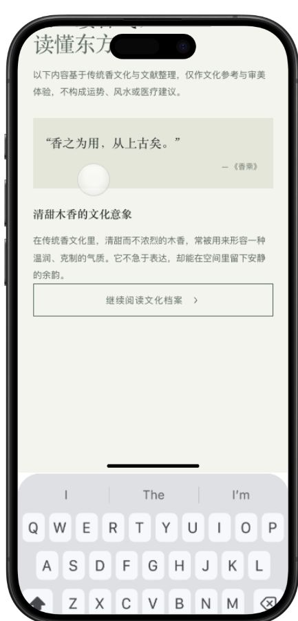
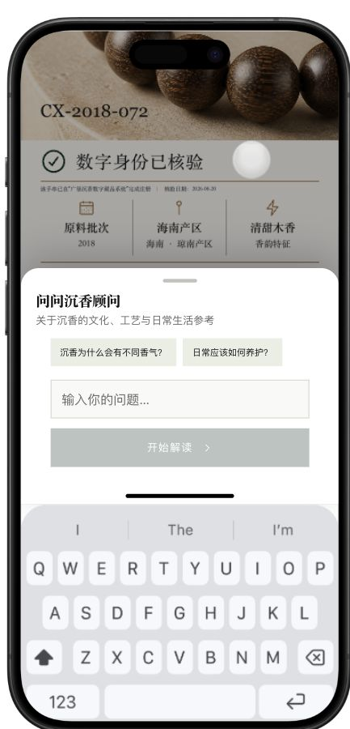
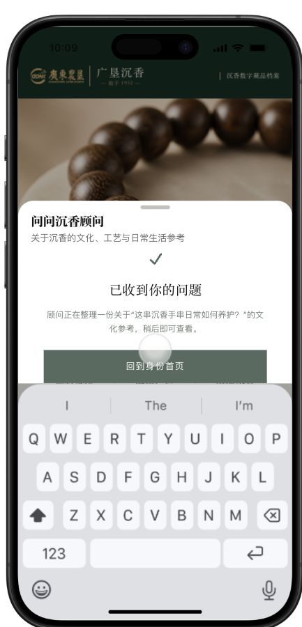
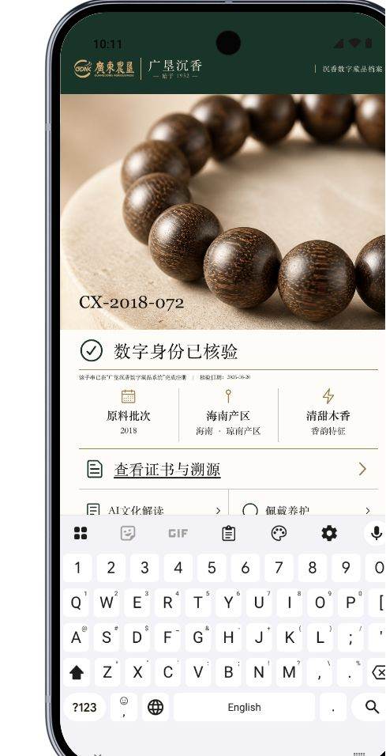

# AI 手串原型 UI 视觉走查

## 整改复验（2026-08-21 11:25）

结论：本报告下方记录的 P0 阻塞项已完成整改，当前 H5 可用于继续演示评审。

- 页面已声明 `zh-CN` 并禁止浏览器自动翻译，避免中文被二次改写及页面定位异常。
- 模拟手机外壳改为不可滚动，滚动仅发生在内部 `MobileScroll`；详情跳转后外壳 `scrollTop` 保持为 `0`。
- iPhone 证书页与 AI 传统文化解读页：键盘关闭，固定顶栏位于安全区内，首标题位于顶栏下方，返回按钮获得焦点。
- AI 香文化顾问：弹层初始不弹键盘，输入框聚焦时弹出，提交后收起，成功状态与“回到身份首页”按钮完整可见。
- Pixel 10：首页键盘关闭，应用视口与 Android 导航栏正确衔接，无内容截断。
- 自动验证：H5 专项回归 3 项通过，完整 Playwright 11 项通过，运行时完整性、生产构建及 Sites 4 项测试通过。

以下内容保留为整改前问题记录。

日期：2026-08-21  
范围：iPhone 首页、证书与溯源、AI 文化解读、AI 香文化顾问，以及 Pixel 10 首页适配。  
结论：视觉方向已经接近“国企品牌 + 数字档案”的目标，但当前版本不建议直接用于客户演示。首要阻塞是模拟键盘在非输入页面异常出现，并遮挡详情页与成功页；其次是详情页安全区、文字可读性和 AI 入口层级。

## 1. 首页 — 基本健康，需优化可读性与主次

优点：手串大图、产品编号、“数字身份已核验”和证书入口形成了清楚的第一阅读路径；深绿、米白和金棕色符合品牌与沉香材质感。

问题：

- 品牌栏同时容纳官方标识、产品品牌和档案名称，横向过挤；右侧档案名称在真机尺寸下过小。
- 核验说明、核验日期、三个属性的辅助文字字号偏小，且灰色与米白底对比不足。
- “AI 文化解读 / 佩戴养护”和下方两个 AI 入口采用近似权重，用户不容易判断哪个是本期主服务。
- “查看证书与溯源”主入口清楚，但其下方连续两排入口使首屏后半段略像功能清单，档案叙事感减弱。

健康度：中上。

## 2. 证书与溯源 — 结构合理，但存在阻塞级显示问题

优点：证书卡 + 时间线适合表达确权和溯源，节点顺序清楚，真实感比单一证书图片更强。

问题：

- P0：未进入任何输入框，系统键盘却自动出现，占据约三分之一屏幕。
- P0：顶部导航栏没有正常出现在可视区，首屏大标题进入灵动岛区域，存在明显安全区冲突。
- P1：证书卡内容过浅，编号、产区、年份等关键信息可读性不足；白色圆形装饰会干扰“已核验”图标的视觉中心。
- P1：打开新页面后，焦点仍停留在上一页“查看证书与溯源”按钮。需要把焦点移动到新页标题或返回按钮，并确保上一页对辅助技术不可读。

健康度：不健康，演示阻塞。

## 3. AI 文化解读 — 文案安全，页面层级受键盘破坏

优点：“仅作文化参考，不构成运势、风水或医疗建议”的表达适合国企项目；引文、文化意象与正文形成了较自然的内容层次。

问题：

- P0：键盘继续异常占位，且顶部标题被灵动岛遮挡，页面工具栏不可见。
- P1：正文灰度偏浅、字号偏小，长段落在手机上阅读压力较大。
- P2：页面下半部留白较多，内容密度与首屏节奏不均衡；可增加“本手串对应解读”标签或卡片，但不建议继续堆功能入口。

健康度：内容健康，视觉状态不健康。

## 4. AI 香文化顾问弹层 — 入口清楚，键盘状态不符合预期

优点：弹层标题、说明、推荐问题、输入框和主按钮顺序正确，用户能理解下一步。

问题：

- P0：弹层刚打开、输入框尚未聚焦时键盘已经出现，挤压了内容空间。
- P1：两个推荐问题按钮较窄，文字密度高；建议增加高度与左右内边距，保证 44px 左右触控区域。
- P1：未输入时主按钮与背景的对比过弱，禁用状态可以保留，但需要更明确的不可用反馈。

健康度：中等，受键盘问题影响。

## 5. AI 提交成功 — 反馈明确，但主操作被遮挡

优点：成功图标、标题和回答预期说明完整，用户知道问题已经被接收。

问题：

- P0：提交后键盘未收起，“回到身份首页”按钮被键盘部分遮挡，破坏闭环。
- P1：结果说明文字过小且偏灰，产品名称被引号包围后排版松散。
- P2：成功状态只有“稍后即可查看”的承诺，缺少明确的结果去向或预计等待状态；演示时容易让客户追问后续页面在哪里。

健康度：不健康，闭环受阻。

## 6. Pixel 10 适配 — 布局基本响应，但同样被键盘阻塞

优点：核心图片、身份标题和属性区能随更宽屏幕扩展，主结构没有发生横向错位。

问题：

- P0：Android 键盘同样异常出现，证明问题不是 iPhone 单一设备状态。
- P1：更宽屏幕下品牌栏仍显拥挤，右侧档案名称依旧过小。
- P1：底部功能入口被键盘截断，无法完成首页完整视觉检查。

健康度：不健康，跨平台阻塞。

## 优先级建议

| 优先级 | 建议 | 验收标准 |
|---|---|---|
| P0 | 修复键盘状态：只有输入框获得焦点时打开；路由跳转、返回、弹层打开前和提交后都应正确收起 | 证书页、文化解读页无键盘；提交成功页主按钮完整可见 |
| P0 | 修复详情页顶部安全区与固定导航栏 | 标题、返回和信息按钮全部位于状态栏/灵动岛下方，不随内容滚走 |
| P1 | 提升小字号与浅灰文字可读性 | 核验说明、证书信息、正文和辅助标签在真实手机尺寸下无需放大即可阅读 |
| P1 | 重排 AI 服务入口主次 | 建议保留“证书溯源”为第一主入口，“AI 文化解读”为第二重点，“养护/知识/顾问”归为辅助服务 |
| P1 | 修正路由焦点与隐藏页面语义 | 进入详情页后焦点落在返回按钮或页面标题；上一页面 `inert`/`aria-hidden` |
| P2 | 优化品牌栏与成功状态文案 | 品牌栏减少同时竞争的文字；成功页明确结果查看方式和状态 |

## 证据边界

- 本次为真实浏览器截图与可见 DOM 走查，未修改代码。
- 已检查 iPhone 和 Pixel 10 主要状态，控制台未发现报错或警告。
- 截图可以确认可见布局、焦点残留和键盘遮挡；颜色对比值、屏幕阅读器播报顺序、缩放重排和完整 WCAG 符合性仍需专项测试。
